# Activity Wheel

A weighted activity wheel that learns your preferences over time to help you decide what to do next.

Everything lives in your browser via IndexedDB by default, with no backend and no accounts required. Signing in with Google is optional, and switches your wheels over to private cloud storage instead.

<p align="center">
	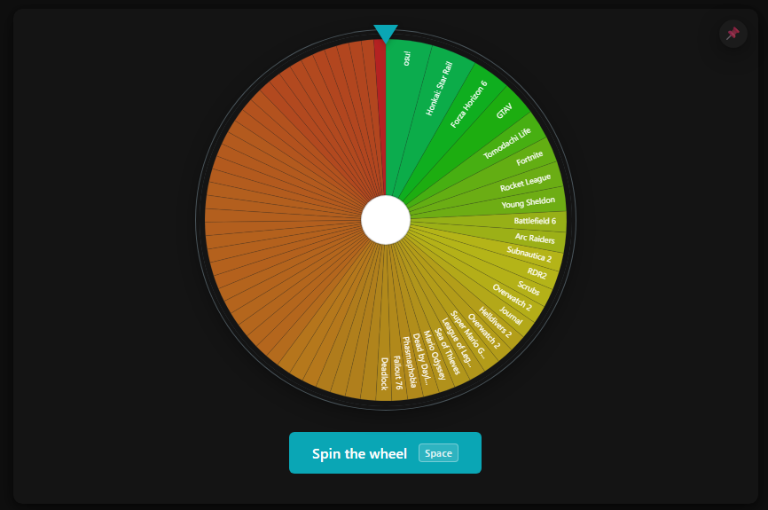
</p>

<details>
<summary>More screenshots</summary>
<br>

| | |
|---|---|
| 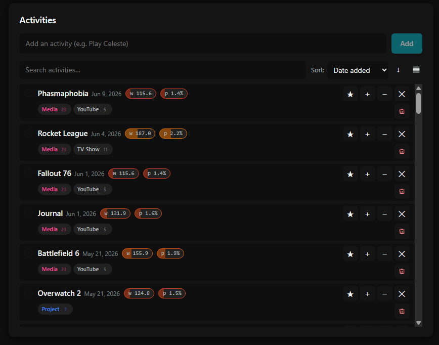 | 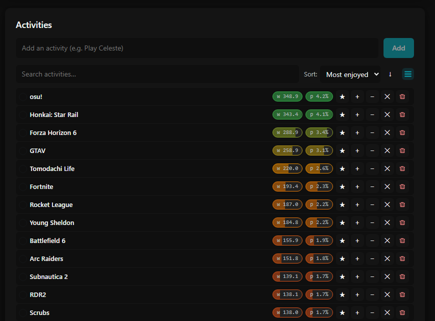 |
| 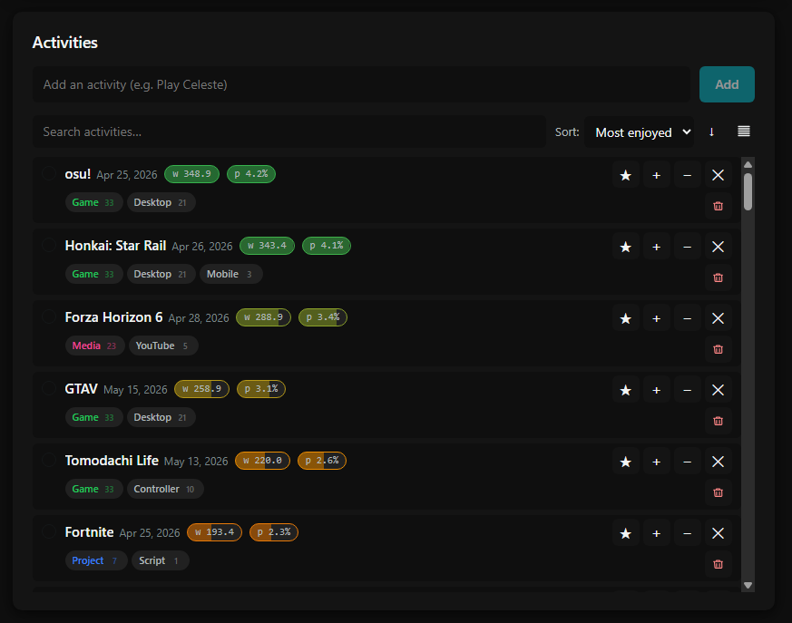 | 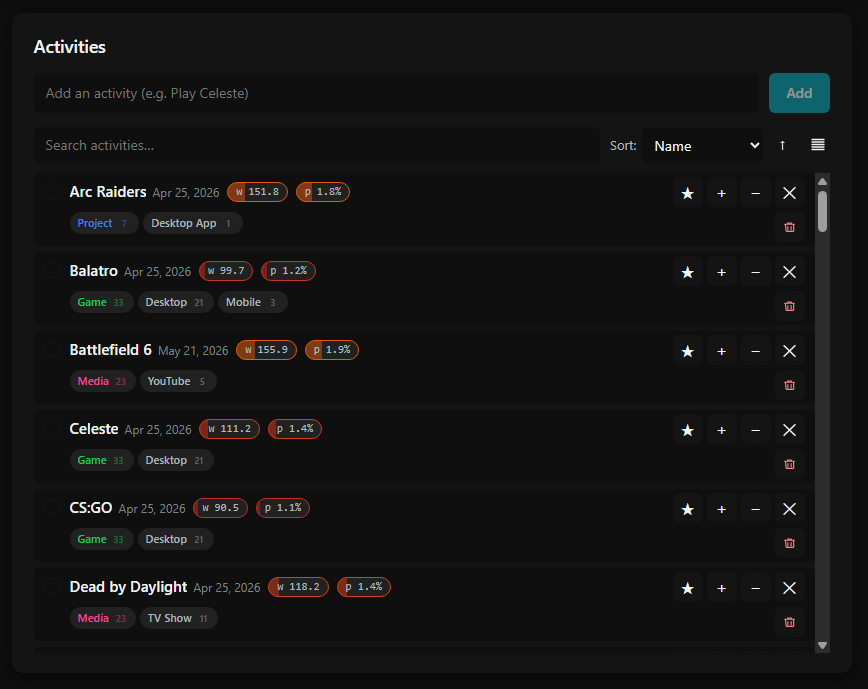 |
| 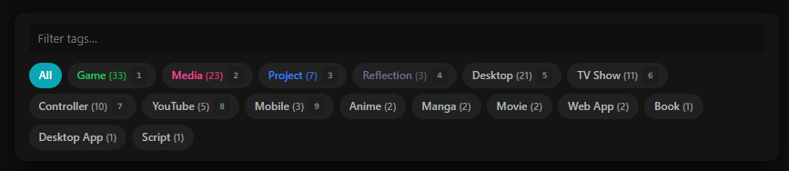 | 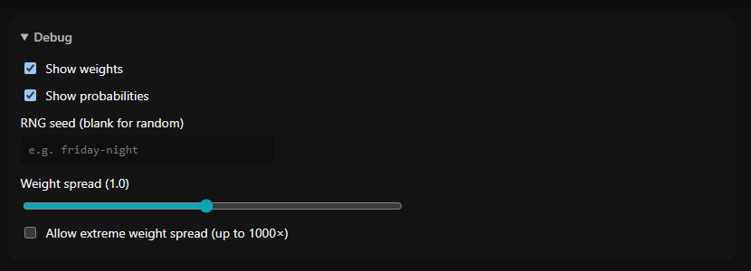 |
| 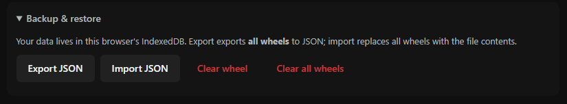 | 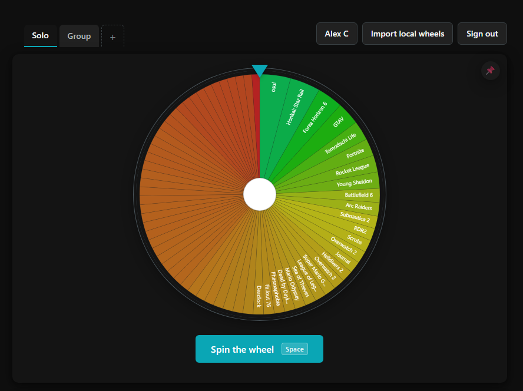 |
| 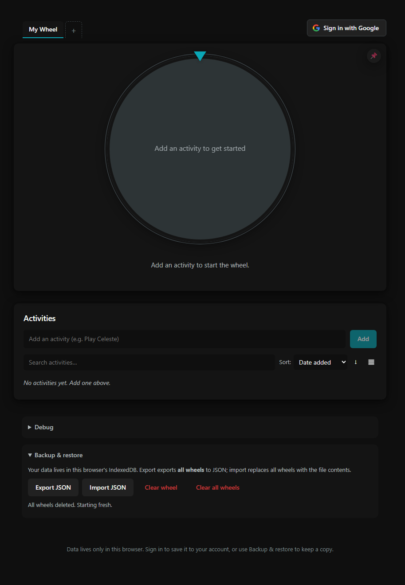 | 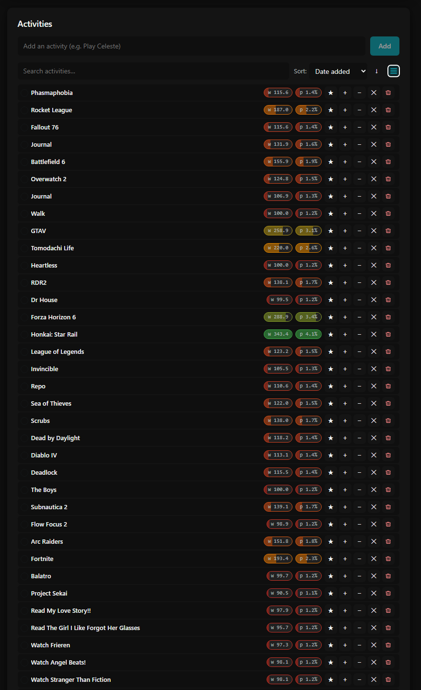 |

</details>

## Get Started

### Using the Github Pages Site

TO BE WRITTEN

### Running Locally

Requires Node 20+.

```bash
npm install
npm run dev
```

## How it works

### Data persistence

By default, the app stores everything in a single IndexedDB database, `activity-wheel`, split across object stores for wheels, activities, and tag metadata.

- The database lives entirely in the browser profile that opens the app.
- Clearing site data, or switching browsers or devices, wipes the data.
- Use **Backup & restore** if you want the data to survive any of that.

Signing in with Google switches you over to private cloud storage instead (see **Signing in** below), where none of the above applies.

### Signing in (optional)

Signing in with Google saves your wheels privately to your account instead of just this browser, so they follow you to any other browser or device you sign into. Each account only ever sees its own data.

You can keep using the app fully signed out. The first time you sign in, an **Import local wheels** button lets you copy whatever you already have in this browser into your new account one time without touching the local copy.

### Weight system

Every activity has a preference weight that quietly shifts based on how you respond to it after a spin. Accepting an activity nudges its weight up a little, rejecting it nudges it down a little, and strong reactions like a big thumbs-up or thumbs-down move it by a lot more.

A few things shape how much a single piece of feedback actually moves the needle:

- Giving the same kind of feedback several times in a row builds momentum, so a streak of accepts (or rejects) carries more weight than a single one-off click.
- A newly added activity can also get a temporary head start so it has a fair chance of being seen early on, fading away over its first week or so.
- As a weight gets close to its upper or lower bound, further nudges in that direction matter less and less, which keeps things from swinging to an extreme too abruptly.

No activity can ever be silenced completely, and none can be guaranteed either: there is always a floor beneath which a weight cannot fall and a ceiling it cannot cross, both of which loosen or tighten automatically depending on how many activities are in the wheel. The wheel also resists letting a single favorite dominate every spin, softening further ordinary increases once something is already winning far more often than its peers, though a deliberate strong "love it" reaction can still push past that resistance.

None of this changes what the numbers mean, only how much influence each one carries when the wheel is spun.

### Activity Selection

The chosen activity is randomly chosen based on the a random number within the total summed weights.

The winning activity is computed before the wheel animates. The animation just rotates the canvas to a precomputed final angle.

### Sessions

A **session** is a single round of "spin until I find something".

- Whatever activity you spin is excluded from the rest of the session, regardless of whether you accept, skip, or reject it, so the next spins always show different options
- Reseting a session puts everything back (Reloading the page resets it too)
- Accepting does not auto-reset the session, so you can still change your mind afterward or spin for your next activity

### Backup & restore

Using the backup and restore buttons, you can export the full database to a JSON file you can keep on disk, email to yourself, or import into a different browser

## Debug mode

Open the **Debug** disclosure to toggle:

- Show weights: Adds an effective-weight pill to each activity row
- Show probabilities: Adds a current-spin probability pill
- RNG seed: When set, every spin uses Mulberry32 seeded by your string + the current pool size and a tick counter, so the same state and seeds gives an identical sequence
- Weight spread: A slider that exaggerates or compresses the differences between activities' weights for previewing, without touching the stored weights themselves
- Allow extreme weight spread: Unlocks a much wider range on the weight spread slider, for stress-testing very lopsided pools

All of these persist to `localStorage`, so they survive a page reload.

## AI Disclosure

This project was developed with the help of Claude Code via the CLI tool.